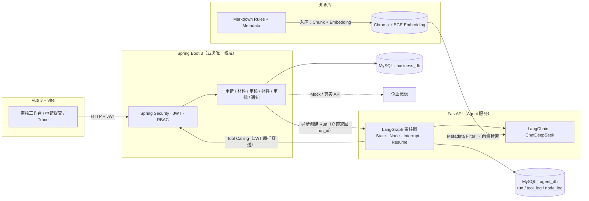

# 学分置换 AI 审核协同平台

> 模拟真实高校学分置换审批业务的 AI 审核协同系统：学生提交申请与材料，AI Agent 依据规则知识库（RAG）逐条审核，老师只复核 AI 结论并做最终审批，Agent 自动推进后续流程并通知学生。

**当前阶段**：架构与数据库设计完成，前端静态交互原型已交付，业务代码未开工（开发路线见下文）。

---

## 1. 这是什么

一个"传统业务后端 + AI Agent"的完整个人项目，核心不是聊天机器人，而是一套**权限受控、人工把关、全程留痕、可持续改进**的审核工作流：

```
学生提交学分置换申请 + 材料（PDF）
        ↓
Spring Boot 创建审核任务（异步 Run）
        ↓
FastAPI + LangGraph 初始化审核 State
        ↓
RAG 检索审核规则（Metadata Filter + 向量检索）
        ↓
逐条规则审核（文件数量 / 类型 / 内容 / 字段完整性）
        ↓  每条规则产出结构化结果（rule_code / status / problem / evidence / confidence）
汇总 → 审核结论 + 问题清单 + 缺失材料清单
        ↓  submit_audit_result 落业务库
Interrupt → 等待老师复核（WAITING_HUMAN_REVIEW）
        ↓
老师：确认 / 修改 / 退回补材料
        ↓
通过 → 老师最终审批（独立人工节点）→ APPROVED
退回 → NEED_SUPPLEMENT → 企业微信通知学生 → 补件后重新审核（同一申请，新 Run）
```

## 2. 架构



**关键原则**：Agent 不直接读写业务数据表——所有业务操作走 `Tool → HTTP → Spring Boot → Spring Security → Service → MySQL`；Agent 自身的运行数据（Trace / 评估 / 经验）由 Python 侧独立管理（agent_db），知识库（Markdown + Chroma）为 Python 侧文件资产。双库双账号物理隔离。

## 3. 技术栈

| 层 | 技术 |
|---|---|
| 前端 | Vue 3 · Vite · Vue Router · Pinia · Axios |
| 业务后端 | Spring Boot 3 · Spring Security · JWT · MyBatis / MyBatis-Plus · MySQL · Redis |
| Agent 服务 | FastAPI · LangChain · LangGraph · langchain-deepseek |
| 知识库（RAG） | Markdown Rules · Metadata 过滤 · 本地 BGE Embedding · Chroma · LangChain Retriever |
| 外部能力 | 企业微信 API（开发期 Mock） |
| 工程化 | Docker（后期） |

## 4. 核心设计

- **规则驱动的逐条审核**：禁止"LLM 一次读完材料直接下结论"。每条规则独立产出结构化结果，缺失材料判 `NEED_SUPPLEMENT / BLOCKED` 而非猜测 FAIL；一期诚实声明不做印章真伪识别（文本线索 + 低置信度 + 老师复核兜底）。
- **RAG = 审核规则获取层**：按场景与材料类型先 Metadata Filter 再向量检索，保证规则命中稳定；不为闲聊问答服务。
- **Human-in-the-loop**：AI 审核完成后 Interrupt，老师复核（确认 / 修改 / 退回）；修改即重新汇总、不再二次打断，最终行政审批保留为独立人工节点——**AI 复核 ≠ 行政审批**。
- **双状态机分离**：Run 生命周期（RUNNING / WAITING_HUMAN_REVIEW / SUCCESS / FAILED / CANCELLED / EXPIRED）与申请业务状态（SUBMITTED / AUDITING / NEED_SUPPLEMENT / WAIT_TEACHER_APPROVAL / APPROVED / REJECTED）分表表达、禁止混用。
- **可观测 → 评估 → 自进化闭环**：Run / Tool / Node 三级 Trace 记录整个审核链；Evaluation 以审核版确定性指标为主（Rule Selection / Audit Accuracy / Issue Extraction / Missing Material Accuracy 等），LLM Judge 仅辅助；老师的人工修改作为最高质量反馈沉淀为结构化经验（document_type / rule_code / issue_type 标签检索），反哺下一次审核。
- **权限即边界**：用户 JWT 原样穿透 `Vue → Spring Boot → FastAPI → Tool → Spring Boot`，Agent 永远不高于当前用户权限；Java 下发权限码过滤可用 Tool，Spring Security 最终兜底。

## 5. 项目结构

```
ai-ticket-platform/
├── frontend/               # Vue3 前端（待开工）
├── backend-java/           # Spring Boot 业务后端（待开工）
├── agent-service/          # FastAPI + LangChain + LangGraph（待开工）
│   └── knowledge-base/     # 审核规则知识库（Markdown，规划中）
├── docs/                   # 工程文档（架构图等）
├── 产品文档/                # 产品与设计资产
│   ├── 20260929/           # PRD 版本快照（v0.2 当前基准 / v0.1 留档）
│   ├── PRODUCT.md          # 产品档案
│   ├── DESIGN.md           # 设计系统规范
│   ├── design.json         # 设计 token sidecar
│   └── ui-mockup/          # 静态交互原型 + 评审记录
├── deploy/                 # 部署配置 + 数据库脚本（deploy/sql/：business_db / agent_db / seed）
└── README.md
```

## 6. 快速预览

无需安装任何依赖，直接用浏览器打开：

```
产品文档/ui-mockup/audit-workbench.html
```

这是**老师审核工作台**的可交互静态原型（演示数据）：左侧按流程节点分组的申请目录树、中间申请详情与材料（含缺失材料提示、预览浮层）、右侧 AI 逐规则审核结果（可展开详情、修改判断并实时重算结论）、确认退回补材料 / 最终审批全流程演示，以及"查看执行详情"抽屉里的 Agent 执行链路。

## 7. 文档

| 文档 | 说明 |
|---|---|
| [产品文档/20260929/学分置换AI审核协同平台-PRD-v0.2.md](产品文档/20260929/学分置换AI审核协同平台-PRD-v0.2.md) | **当前基准 PRD**（架构决策 / 审核设计 / 知识库方案 / 状态机 / 开发计划） |
| [产品文档/DESIGN.md](产品文档/DESIGN.md) | 设计系统规范（token / 命名法则 / 组件语法） |
| [产品文档/PRODUCT.md](产品文档/PRODUCT.md) | 产品档案（用户 / 定位 / 能力边界 / 原则） |
| [产品文档/README.md](产品文档/README.md) | 产品资产索引 |

## 8. 开发路线

| 阶段 | 内容 | 状态 |
|---|---|---|
| 设计 | 架构设计 · PRD · 数据库设计 · UI 交互原型 | ✅ 进行中（字段设计待终审） |
| P0 骨架 | 三服务 + MySQL + Redis 启动互 Ping | ⬜ |
| P1 业务底座 | 用户 / 角色 / JWT / RBAC · 申请 CRUD · 材料上传 · 通知记录 | ⬜ |
| P2 审核 Agent 闭环 | 规则入库 · RAG 检索 · 逐规则审核 · 结构化结果落库 | ⬜ |
| P3 LangGraph 完整化 | Interrupt / Resume · 执行分支 · Redis Checkpoint（7 天 TTL）· 幂等 | ⬜ |
| P4 可观测 | Trace 页面（审核链回放） | ⬜ |
| P5 企微 + 工程完善 | 企微 Mock/Real · 权限预检 · 幂等 · 异常处理 | ⬜ |
| P6 Evaluation | 30~50 案例数据集 · 自动回放 · 指标计算 · LLM Judge | ⬜ |
| P7 Evolution | 经验抽取 / 存储 / 检索闭环 | ⬜ |

二期规划：OCR / Vision 印章核验、Rerank、SSE 实时推送、Docker、知识库管理 UI、经验向量检索。

---

*本文档与 [PRD v0.2](产品文档/20260929/学分置换AI审核协同平台-PRD-v0.2.md) 共同构成项目当前基准。*
